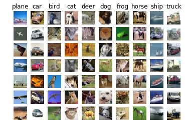
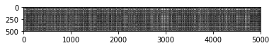
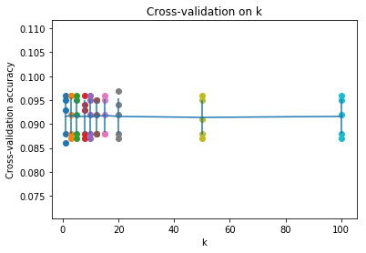

# A1-1 kNN算法，向量化思想与交叉验证

*Complete and hand in this completed worksheet (including its outputs and any supporting code outside of the worksheet) with your assignment submission. For more details see the [assignments page](http://vision.stanford.edu/teaching/cs231n/assignments.html) on the course website.*

讲义参考：<http://cs231n.github.io/classification/>

## 1. kNN算法介绍

kNN分类器的分类步骤：

- 训练过程，kNN分类器记录所有训练数据。
- 预测过程，kNN分类器计算每个测试数据和所有训练数据的距离，取离测试数据最近的`k`个训练数据的标签，取出现次数最多的标签作为该测试数据的标签。
- 通过交叉验证方法获取超参数`k`的值。


## 2. 导入数据集

我们使用的是`CIFAR-10`数据集。


```python
# Run some setup code for this notebook.

import random
import numpy as np
from cs231n.data_utils import load_CIFAR10
import matplotlib.pyplot as plt

# This is a bit of magic to make matplotlib figures appear inline in the notebook
# rather than in a new window.
%matplotlib inline
plt.rcParams['figure.figsize'] = (10.0, 8.0) # set default size of plots
plt.rcParams['image.interpolation'] = 'nearest'
plt.rcParams['image.cmap'] = 'gray'

# Some more magic so that the notebook will reload external python modules;
# see http://stackoverflow.com/questions/1907993/autoreload-of-modules-in-ipython
%load_ext autoreload
%autoreload 2
```


```python
# Load the raw CIFAR-10 data.
cifar10_dir = 'cs231n/datasets/cifar-10-batches-py'

# Cleaning up variables to prevent loading data multiple times (which may cause memory issue)
try:
   del X_train, y_train
   del X_test, y_test
   print('Clear previously loaded data.')
except:
   pass

X_train, y_train, X_test, y_test = load_CIFAR10(cifar10_dir)

# As a sanity check, we print out the size of the training and test data.
print('Training data shape: ', X_train.shape)
print('Training labels shape: ', y_train.shape)
print('Test data shape: ', X_test.shape)
print('Test labels shape: ', y_test.shape)
```

    Training data shape:  (50000, 32, 32, 3)
    Training labels shape:  (50000,)
    Test data shape:  (10000, 32, 32, 3)
    Test labels shape:  (10000,)


```python
# Visualize some examples from the dataset.
# We show a few examples of training images from each class.
classes = ['plane', 'car', 'bird', 'cat', 'deer', 'dog', 'frog', 'horse', 'ship', 'truck']
num_classes = len(classes)
samples_per_class = 7
for y, cls in enumerate(classes):
    idxs = np.flatnonzero(y_train == y)
    idxs = np.random.choice(idxs, samples_per_class, replace=False)
    for i, idx in enumerate(idxs):
        plt_idx = i * num_classes + y + 1
        plt.subplot(samples_per_class, num_classes, plt_idx)
        plt.imshow(X_train[idx].astype('uint8'))
        plt.axis('off')
        if i == 0:
            plt.title(cls)
plt.show()
```





## 3. 模型建立

由于kNN算法的计算量很大，我们从数据集中随机选取5000张图片作为训练数据和500张图片作为测试数据。

```python
# Subsample the data for more efficient code execution in this exercise
num_training = 5000
mask = np.random.choice(range(X_train.shape[0]), num_training)
X_train = X_train[mask]
y_train = y_train[mask]

num_test = 500
mask = np.random.choice(range(X_test.shape[0]), num_test)
X_test = X_test[mask]
y_test = y_test[mask]

# Reshape the image data into rows
X_train = np.reshape(X_train, (X_train.shape[0], -1))
X_test = np.reshape(X_test, (X_test.shape[0], -1))
print(X_train.shape, X_test.shape)
```

    (5000, 3072) (500, 3072)

导入k近邻算法的相关代码文件，如果你是在自己完成这项作业，那么需要完成文件`cs231n/classifiers/KNearestNeighbor.py`中相关`TODO`项的补充。

```python
from cs231n.classifiers import KNearestNeighbor

# Create a kNN classifier instance. 
# Remember that training a kNN classifier is a noop: 
# the Classifier simply remembers the data and does no further processing 
classifier = KNearestNeighbor()
classifier.train(X_train, y_train)
```

We would now like to classify the test data with the kNN classifier. Recall that we can break down this process into two steps: 

1. First we must compute the distances between all test examples and all train examples. 
2. Given these distances, for each test example we find the k nearest examples and have them vote for the label

Lets begin with computing the distance matrix between all training and test examples. For example, if there are **Ntr** training examples and **Nte** test examples, this stage should result in a **Nte x Ntr** matrix where each element (i,j) is the distance between the i-th test and j-th train example.

**Note: For the three distance computations that we require you to implement in this notebook, you may not use the np.linalg.norm() function that numpy provides.**

关于 **np.linalg.norm()** 的说明：

这个函数用于计算一个向量/矩阵的范数，对于向量$\boldsymbol x = (x_1, x_2, ..., x_n)$定义其p-范数(p-norm)如下：
$$
\|x\|_p = (|x_1|^p + |x_2|^p + ... + |x_n|^p)^{\frac {1}{p}}
$$
如果取$$p=2$$，我们就得到了这里所定义的向量距离（也被称作 L2 距离）；如果取$$p=1$$，所得即为讲义中的 L1 距离。此处禁用该函数是为了在作业中自己实现上述 L2 距离公式，因此不要使用 **np.linalg.norm()** 函数。

First, open `cs231n/classifiers/k_nearest_neighbor.py` and implement the function `compute_distances_two_loops` that uses a (very inefficient) double loop over all pairs of (test, train) examples and computes the distance matrix one element at a time.


```python
# Open cs231n/classifiers/k_nearest_neighbor.py and implement
# compute_distances_two_loops.

# Test your implementation:
dists = classifier.compute_distances_two_loops(X_test)
print(dists.shape)
# print(dists[0:10, 0:10])
```

    (500, 5000)

**说明**：这里我们对所得距离矩阵做了一次可视化，横轴为训练集，纵轴为测试集，每个对应点即为两条对应数据之间的 L2 距离。根据图片的显示原则，如果距离接近 0，那么显示出的颜色会接近黑色，而距离越大，显示出的颜色就越接近白色。

```python
# We can visualize the distance matrix: each row is a single test example and
# its distances to training examples
plt.imshow(dists, interpolation='none')
plt.show()
```





**Inline Question 1** 

Notice the structured patterns in the distance matrix, where some rows or columns are visible brighter. (Note that with the default color scheme black indicates low distances while white indicates high distances.)

- What in the data is the cause behind the distinctly bright rows?
- What causes the columns?

$\color{blue}{\textit Your Answer:}$ 
- A bright row means that the test data of this row has a distinct difference from the training data because the white color indicates high distances between two pictures.
- Similarly, a bright column indicates that this record of training data has a obvious bias with other data. In a word, this column might be some noise from the training set.


此处需要在分类器中实现函数`predict_label`以根据一个距离矩阵来预测每个测试数据的标签。

```python
# Now implement the function predict_labels and run the code below:
# We use k = 1 (which is Nearest Neighbor).
y_test_pred = classifier.predict_labels(dists, k=1)

# Compute and print the fraction of correctly predicted examples
num_correct = np.sum(y_test_pred == y_test)
accuracy = float(num_correct) / num_test
print('Got %d / %d correct => accuracy: %f' % (num_correct, num_test, accuracy))
```

    Got 52 / 500 correct => accuracy: 0.104000


You should expect to see approximately `27%` accuracy. （这是旧版的精确度，其数据不准确）Now lets try out a larger `k`, say `k = 5`:


```python
y_test_pred = classifier.predict_labels(dists, k=5)
num_correct = np.sum(y_test_pred == y_test)
accuracy = float(num_correct) / num_test
print('Got %d / %d correct => accuracy: %f' % (num_correct, num_test, accuracy))
```

    Got 53 / 500 correct => accuracy: 0.106000


You should expect to see a slightly better performance than with `k = 1`.

**Inline Question 2 （可以暂时跳过这个问题）**

We can also use other distance metrics such as L1 distance.
For pixel values $p_{ij}^{(k)}$ at location $(i,j)$ of some image $I_k$, 

the mean $\mu$ across all pixels over all images is $$\mu=\frac{1}{nhw}\sum_{k=1}^n\sum_{i=1}^{h}\sum_{j=1}^{w}p_{ij}^{(k)}$$
And the pixel-wise mean $\mu_{ij}$ across all images is 
$$\mu_{ij}=\frac{1}{n}\sum_{k=1}^np_{ij}^{(k)}.$$
The general standard deviation $\sigma$ and pixel-wise standard deviation $\sigma_{ij}$ is defined similarly.

Which of the following preprocessing steps will not change the performance of a Nearest Neighbor classifier that uses L1 distance? Select all that apply.
1. Subtracting the mean $\mu$ ($\tilde{p}_{ij}^{(k)}=p_{ij}^{(k)}-\mu$.)
2. Subtracting the per pixel mean $\mu_{ij}$  ($\tilde{p}_{ij}^{(k)}=p_{ij}^{(k)}-\mu_{ij}$.)
3. Subtracting the mean $\mu$ and dividing by the standard deviation $\sigma$.
4. Subtracting the pixel-wise mean $\mu_{ij}$ and dividing by the pixel-wise standard deviation $\sigma_{ij}$.
5. Rotating the coordinate axes of the data.

$\color{blue}{\textit Your Answer:}$ 3


$\color{blue}{\textit Your Explanation:}$


## 4. 向量化计算

由于`numpy`库实现了很多简化计算的数值方法，我们在直接使用向量和矩阵进行计算时可以显著的提高计算速度，在分类器代码中实现不同形式的向量化计算方法，然后运行下面的代码来分别观察使用双重循环、单重循环和不使用循环的距离计算方法的计算时间差距：

通过与之前两重循环所得的距离矩阵检测来判断你的实现算法是否正确。

```python
# Now lets speed up distance matrix computation by using partial vectorization
# with one loop. Implement the function compute_distances_one_loop and run the
# code below:
dists_one = classifier.compute_distances_one_loop(X_test)

# To ensure that our vectorized implementation is correct, we make sure that it
# agrees with the naive implementation. There are many ways to decide whether
# two matrices are similar; one of the simplest is the Frobenius norm. In case
# you haven't seen it before, the Frobenius norm of two matrices is the square
# root of the squared sum of differences of all elements; in other words, reshape
# the matrices into vectors and compute the Euclidean distance between them.
difference = np.linalg.norm(dists - dists_one, ord='fro')
print('One loop difference was: %f' % (difference, ))
if difference < 0.001:
    print('Good! The distance matrices are the same')
else:
    print('Uh-oh! The distance matrices are different')
```

    One loop difference was: 0.000000
    Good! The distance matrices are the same


```python
# Now implement the fully vectorized version inside compute_distances_no_loops
# and run the code
dists_two = classifier.compute_distances_no_loops(X_test)

# check that the distance matrix agrees with the one we computed before:
difference = np.linalg.norm(dists - dists_two, ord='fro')
print('No loop difference was: %f' % (difference, ))
if difference < 0.001:
    print('Good! The distance matrices are the same')
else:
    print('Uh-oh! The distance matrices are different')
```

    No loop difference was: 0.000000
    Good! The distance matrices are the same

对三种方法分开计时，结果差距十分明显。

```python
# Let's compare how fast the implementations are
def time_function(f, *args):
    """
    Call a function f with args and return the time (in seconds) that it took to execute.
    """
    import time
    tic = time.time()
    f(*args)
    toc = time.time()
    return toc - tic

two_loop_time = time_function(classifier.compute_distances_two_loops, X_test)
print('Two loop version took %f seconds' % two_loop_time)

one_loop_time = time_function(classifier.compute_distances_one_loop, X_test)
print('One loop version took %f seconds' % one_loop_time)

no_loop_time = time_function(classifier.compute_distances_no_loops, X_test)
print('No loop version took %f seconds' % no_loop_time)

# You should see significantly faster performance with the fully vectorized implementation!

# NOTE: depending on what machine you're using, 
# you might not see a speedup when you go from two loops to one loop, 
# and might even see a slow-down.
```

    Two loop version took 30.262069 seconds
    One loop version took 55.174328 seconds
    No loop version took 0.199847 seconds


## 5. 交叉验证方法（Cross-validation）

We have implemented the k-Nearest Neighbor classifier but we set the value k = 5 arbitrarily. We will now determine the best value of this hyperparameter with cross-validation.

通过交叉验证方法来选择最佳的`k`值。


```python
# shuffle the train array
mask = np.array(list(range(X_train.shape[0])))
np.random.shuffle(mask)
X_train = X_train[mask]
y_train = y_train[mask]
X_train.shape, y_train.shape
```


    ((5000, 3072), (5000,))


```python
num_folds = 5
k_choices = [1, 3, 5, 8, 10, 12, 15, 20, 50, 100]

X_train_folds = []
y_train_folds = []
################################################################################
# TODO:                                                                        #
# Split up the training data into folds. After splitting, X_train_folds and    #
# y_train_folds should each be lists of length num_folds, where                #
# y_train_folds[i] is the label vector for the points in X_train_folds[i].     #
# Hint: Look up the numpy array_split function.                                #
################################################################################
# *****START OF YOUR CODE (DO NOT DELETE/MODIFY THIS LINE)*****

X_train_folds.extend(np.array_split(X_train, num_folds))
y_train_folds.extend(np.array_split(y_train, num_folds))

# *****END OF YOUR CODE (DO NOT DELETE/MODIFY THIS LINE)*****

# A dictionary holding the accuracies for different values of k that we find
# when running cross-validation. After running cross-validation,
# k_to_accuracies[k] should be a list of length num_folds giving the different
# accuracy values that we found when using that value of k.
k_to_accuracies = {}


################################################################################
# TODO:                                                                        #
# Perform k-fold cross validation to find the best value of k. For each        #
# possible value of k, run the k-nearest-neighbor algorithm num_folds times,   #
# where in each case you use all but one of the folds as training data and the #
# last fold as a validation set. Store the accuracies for all fold and all     #
# values of k in the k_to_accuracies dictionary.                               #
################################################################################
# *****START OF YOUR CODE (DO NOT DELETE/MODIFY THIS LINE)*****

for fold in range(num_folds):
    knn = KNearestNeighbor()
    # copy the two lists
    X_lst = list(X_train_folds)
    y_lst = list(y_train_folds)
    
    X_val = X_lst.pop(fold)
    y_val = y_lst.pop(fold)
    
    cur_X_train = np.concatenate(X_lst, axis=0)
    cur_y_train = np.concatenate(y_lst, axis=0)
    
    model = KNearestNeighbor()
    model.train(cur_X_train, cur_y_train)
    
    for k in k_choices:
        y_pred = model.predict(X_val, k=k)
        acc = np.mean(y_pred == y_val)
        if k not in k_to_accuracies:
            k_to_accuracies[k] = []
        k_to_accuracies[k].append(acc)
    
    del model

# *****END OF YOUR CODE (DO NOT DELETE/MODIFY THIS LINE)*****

# Print out the computed accuracies
for k in sorted(k_to_accuracies):
    for accuracy in k_to_accuracies[k]:
        print('k = %d, accuracy = %f' % (k, accuracy))
```

    k = 1, accuracy = 0.096000
    k = 1, accuracy = 0.095000
    k = 1, accuracy = 0.093000
    k = 1, accuracy = 0.088000
    k = 1, accuracy = 0.086000
    k = 3, accuracy = 0.096000
    k = 3, accuracy = 0.096000
    k = 3, accuracy = 0.092000
    k = 3, accuracy = 0.088000
    .
    .
    .
    k = 100, accuracy = 0.088000
    k = 100, accuracy = 0.087000


```python
# plot the raw observations
for k in k_choices:
    accuracies = k_to_accuracies[k]
    plt.scatter([k] * len(accuracies), accuracies)

# plot the trend line with error bars that correspond to standard deviation
accuracies_mean = np.array([np.mean(v) for k,v in sorted(k_to_accuracies.items())])
accuracies_std = np.array([np.std(v) for k,v in sorted(k_to_accuracies.items())])
plt.errorbar(k_choices, accuracies_mean, yerr=accuracies_std)
plt.title('Cross-validation on k')
plt.xlabel('k')
plt.ylabel('Cross-validation accuracy')
plt.show()
```





```python
# Based on the cross-validation results above, choose the best value for k,   
# retrain the classifier using all the training data, and test it on the test
# data. You should be able to get above 28% accuracy on the test data.
best_k = 20

classifier = KNearestNeighbor()
classifier.train(X_train, y_train)
y_test_pred = classifier.predict(X_test, k=best_k)

# Compute and display the accuracy
num_correct = np.sum(y_test_pred == y_test)
accuracy = float(num_correct) / num_test
print('Got %d / %d correct => accuracy: %f' % (num_correct, num_test, accuracy))
```

    Got 53 / 500 correct => accuracy: 0.106000


**Inline Question 3**

Which of the following statements about $k$-Nearest Neighbor ($k$-NN) are true in a classification setting, and for all $k$? Select all that apply.
1. The decision boundary of the k-NN classifier is linear.
2. The training error of a 1-NN will always be lower than that of 5-NN.
3. The test error of a 1-NN will always be lower than that of a 5-NN.
4. The time needed to classify a test example with the k-NN classifier grows with the size of the training set.
5. None of the above.

$\color{blue}{\textit Your Answer:}$
4

$\color{blue}{\textit Your Explanation:}$
the knn algorithm needs to compute the distance between the test example and all training data, so time grows when training set gets bigger.


